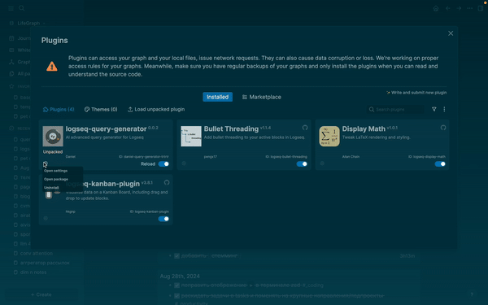
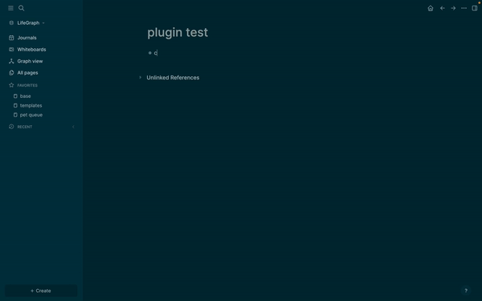

# AI Advanced query generator for LogSeq

### New feature:
Added [tiny model](https://huggingface.co/mandanya/Qwen2.5-Coder-0.5B-LCQ-v2) for free and fast usage.
I created a [dataset](https://huggingface.co/datasets/mandanya/logseq-query-clojure-big) of ~100 axamples of advanced queries and generated ~4500 synthetic examples.
The [model](https://huggingface.co/mandanya/Qwen2.5-Coder-0.5B-LCQ-v2) was trained on this data based on [Qwen2.5-Coder-0.5B-Instruct](https://huggingface.co/Qwen/Qwen2.5-Coder-0.5B-Instruct).
The model is available for free and hosted on my vm. I'm planning to add self-hosted version of the model.
### How to use:
1. You should add OpenAI API key to plugin settings or set to use special model.

2. You can describe what the query should return in logseq block, then access the generation via /`Generate advanced query with ai`

### Future plans
- [ ] Add more complex prompts for complex queries with visualizations
- [x] Train tiny model for faster and free usage
- [ ] Add self-hosted tiny model for free and fast usage

If you find this plugin useful, I'll be glad if you support me by [buing me a coffe](https://buymeacoffee.com/danzholkr)
