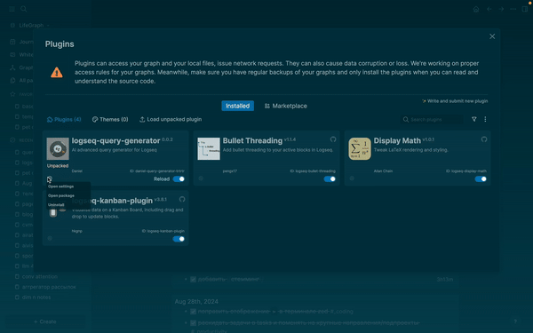
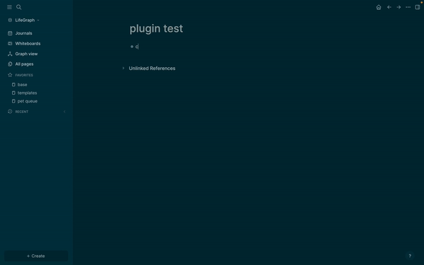

# AI Advanced query generator for LogSeq

1. You should add OpenAI API key to plugin settings.

2. You can describe what the query should return in logseq block, then access the generation via /`Generate advanced query with ai`

### Future plans
- [ ] Add more complex prompts for complex queries with visualizations
- [ ] Add self-hosted tiny model for free and fast usage

If you find this plugin useful, I'll be glad if you support me by [buing me a coffe](https://buymeacoffee.com/danzholkr)
